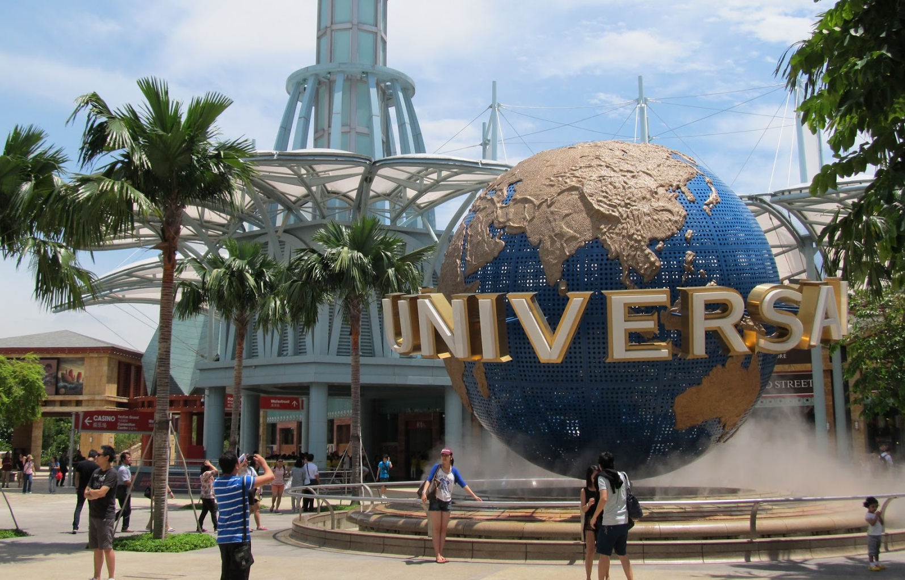
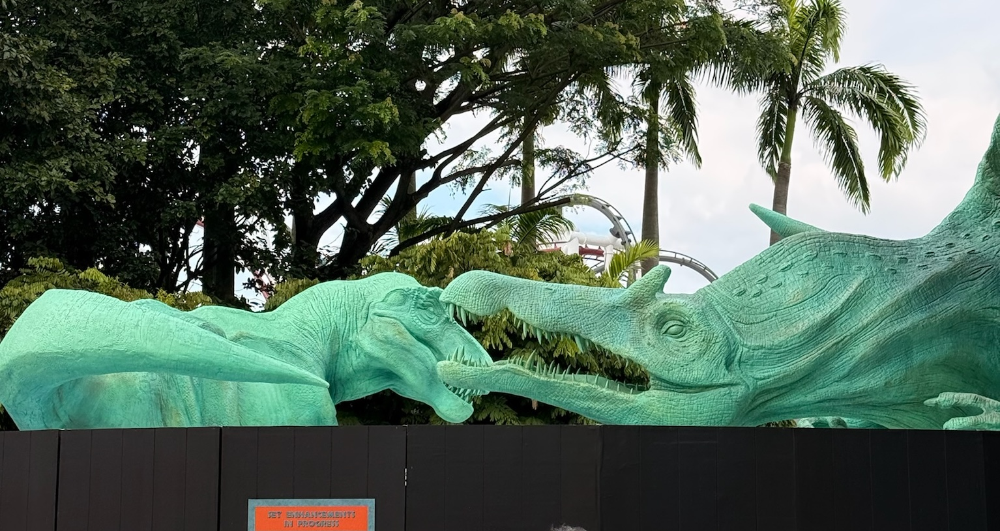
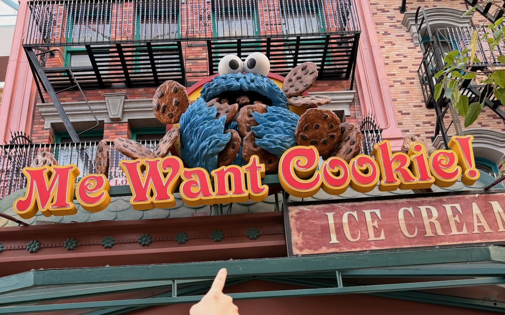

I went to Universal Studios Singapore with my girlfriend this Christmas. 200 dollar tickets[^1] aside, I had a pretty good time. It's quaint. Feels like going to visit your grandparents.

Universal Studios Singapore first opened in March 2010, the result of a successful bid by Genting Singapore to develop Sentosa island. Being the isolated runt of the litter of Universal theme parks, Genting took almost no risks in their initial selection of rides for the park, with almost every single area and attraction being based off of already successful rides or concepts from the late 90s to the early 2000s[^2][^3].

The result is a snapshot of the 2000s and the 2010s, trapped in amber and preserved for our year of 2025.

The whole park is infused with this obliviousness of the present. A blissful lack of awareness to the long decades of mediocre sequels and reboots, or simple non-existence of the franchises it's representing.

The Lost World© has set design lifted straight out of 1993, and a bronze spinosaurus cast lifted straight from the 2001's Jurassic Park 3. Shrek 4-D[^4] is a 22 year old ride, designed as a followup to the 24(!) year old Shrek movie, with animatronic characters helpfully summarizing the first movie to inform us which movie this is a sequel to. Revenge of the Mummy: The Ride[^5] still thinks Brendan Fraser is the star of the mummy franchise. The twin Battlestar Galactica rides[^6] are tinted in the campy charm of mid-2000s low-budget tv sci-fi, a la Doctor Who and Star Trek Enterprise. Lights Camera Action[^9] uses a faux CRT TV to deliver it's exposition.

Even the newer rides and areas are old added later on in the early 2010s are from properties from the 2000s or earlier: _Transformers_: The Ride[^7] picks up where the first movie left off, _Sesame Street_ Spaghetti Space Chase[^8] is obviously childhood nostalgia themed. Even Minions Land, opened in 2025, picks up where the 2010 movie left off, before illumination decided to monetize the yellow plague.

So yeah. It's small, it's expensive, it's old and dated. But for someone like me, in their late 20s, it managed to re-capture a time before the financial crisis, before I got a smart phone, before TikTok, before I grew up into this adulthood unease. And I guess that's worth something. Maybe a plush at the gift shop.

[^1]: 85 dollars for a ticket, 120 dollars for express pass
[^2]: With the exception of "Lights, Camera, Action", which is a spiritual successor to existing attractions in the US which have been around since the early 90s
[^3]: Technically Madagascar had novel rides, but it didn't open with the park so I'm not going to count it.
[^4]: 2/5 attraction that loses novelty quick. Wouldn't go again.
[^5]: 5/5 ride. One of the best rides in the park.
[^6]: 4/5 rollercoasters that happens to have a bit of battlestar galactica paint on it.
[^7]: 4/5 3D ride, but suffers a little from lack of novelty
[^8]: 4/5 for a cute sesame street themed kiddie ride with animatronics 
[^9]: 4/5 intense standing attraction.